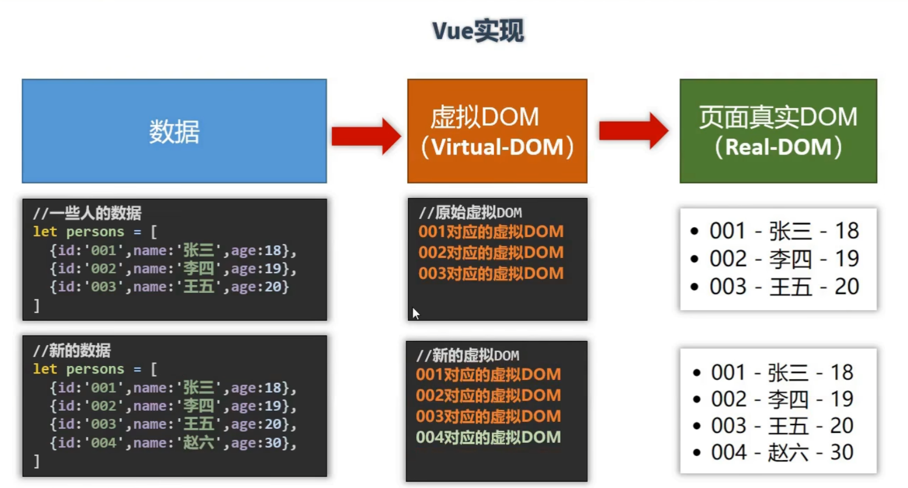

# Vue 全家桶学习 
俺又来力 嗨嗨嗨
# 特点
1. 采用组件化的形式，提高代码复用率，让代码更好维护
2. 声明式编码，让编程人员无需直接操作 DOM 提高开发效率 （传统 JavaScript 需要一步一步操作dom 包含拼接HTML之类的操作）
3. 新增虚拟 DOM 优化数据变更之后的操作

当数据变化之后 虚拟 DOM 中使用 Diff 将之前的代码与之前内存中渲染的数据进行比较
4. 模板和数据绑定  组件化和虚拟 DOM 

